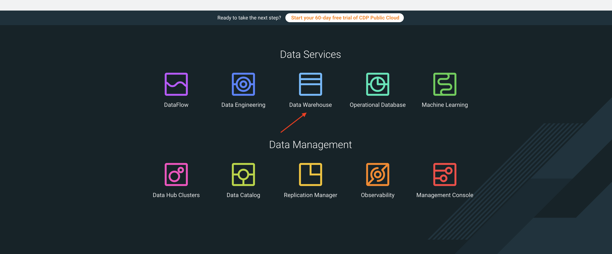
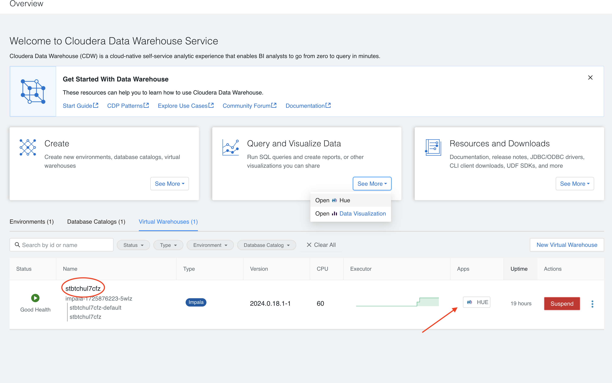
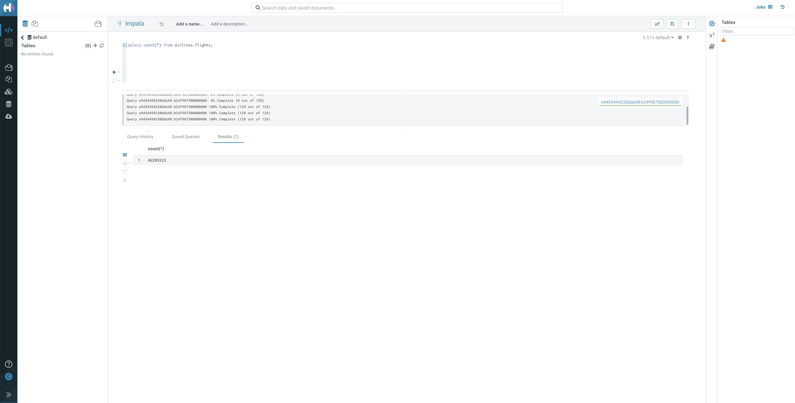
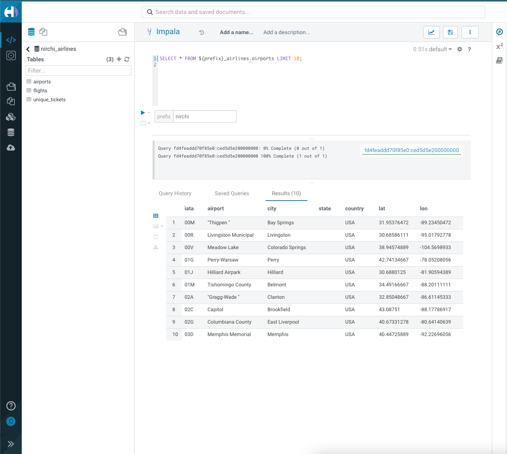
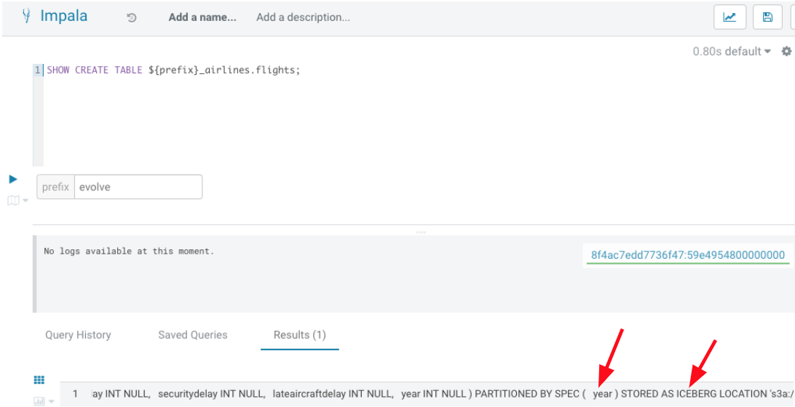
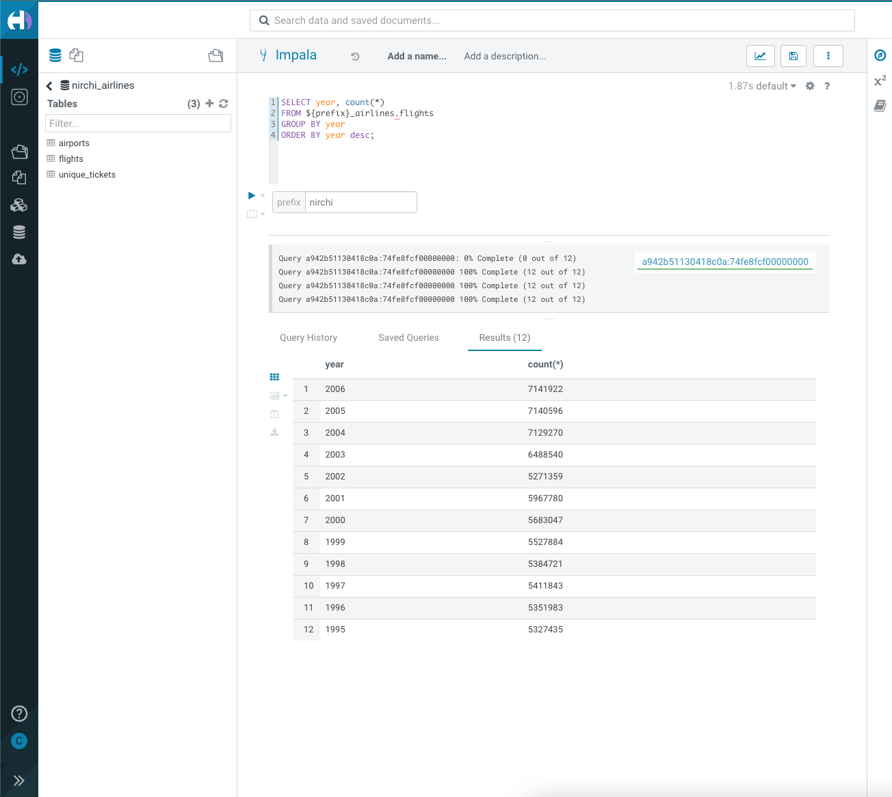
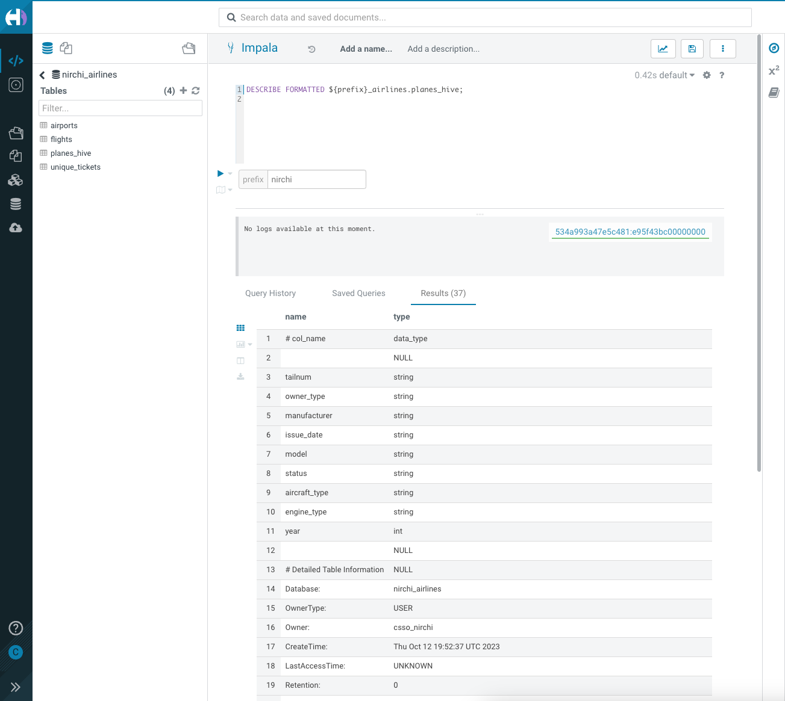
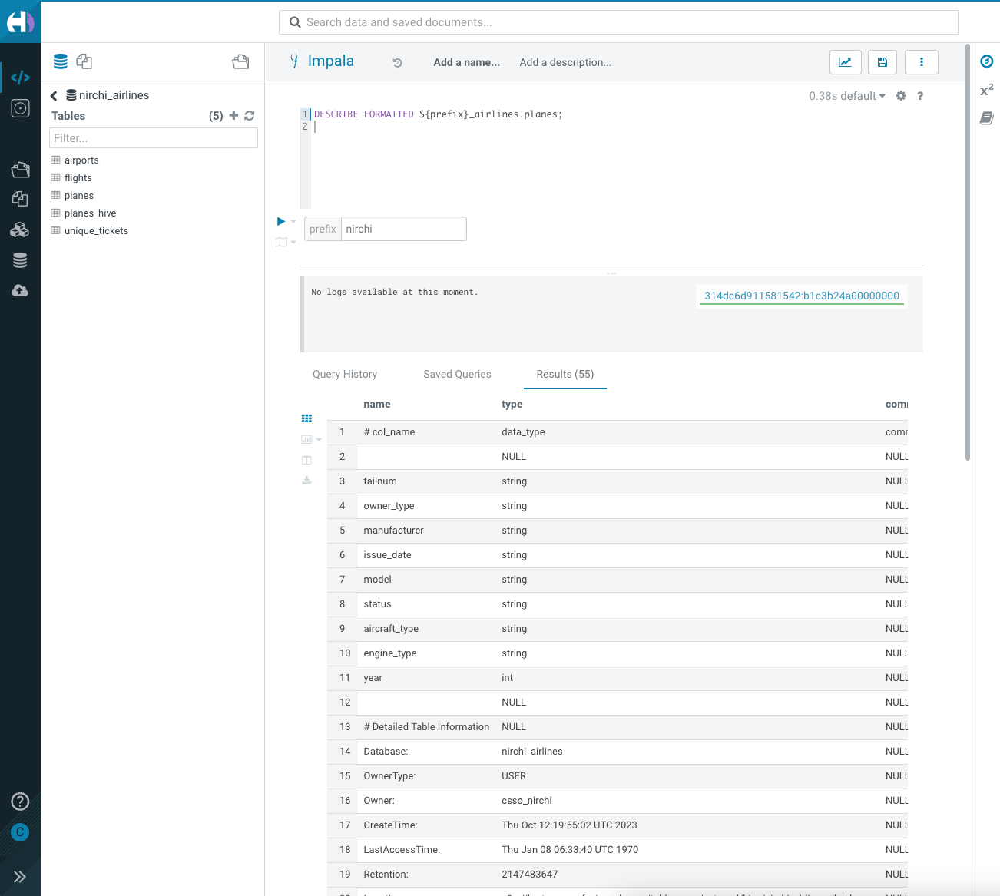

# 01_ingest

As part of the `Ingest` phase, we will ingest data from an S3 Bucket into Impala Tables using Hue.

In Streaming Data Distribution pattern, we will use Cloudera Data Flow (CDF) to ingest data from numerous other sources. 

The primary goal of this is to build an ingestion data pipeline.

- Source data is pre-loaded in an S3 Bucket in CSV format. There are 5 datasets that we need to ingest into Impala.

    - Flights
    - Airports
    - Planes
    - Airlines
    - Passengers

- We connect to the source bucket, pull all 5 datasets, and ingest them into the CDP Data Lakehouse (using Impala in this case) for further analysis in the [Analyze](02_analyze.md) phase and ultimately into our Machine Learning Prediction Model.

## Lab 1: Ingest Flights Raw Data

- In this lab, we will first create a **raw layer** in our Data Lakehouse. This raw layer will be created by leveraging CSV data that has already been stored in our Public Cloud storage, in this lab we will use S3, for the 5 tables mentioned above
- This lab is meant to show how quickly you can take raw data and enable the ability to execute SQL queries against that data

1. In your CDP Home Page, click on **Data Warehouse**. (For more information about Data Warehouse, here is a [product tour](https://docs.cloudera.com/data-warehouse/cloud/index.html))

   

2. On the Data Warehouse landing page

   a. Note the **Environment Name** (circled in below screenshot) as it will be used as one of the inputs while we create tables
   

3. Click on **Hue** to open a new browser tab for the Impala query user interface in Hue.

   

4.  Create a database for the ***raw layer*** by entering the query below into the Hue Impala editor. This database will be called `<prefix>_airlines_raw`, replacing `<prefix>` with your unique prefix.

   ```
   CREATE DATABASE ${prefix}_airlines_raw;
   ```

   - In the **prefix** field, enter a short unique identifier.
   - Click the **Execute button** (*Play* icon), to the left of the editor text box, to execute the query.
   - If you run this and it returns ***Database already exists***, it means this prefix was already used. Choose another prefix value and re-run the query.

5. Create the `flights` table by entering and executing the query below - 

   ```
   drop table if exists ${prefix}_airlines_raw.flights;

   CREATE EXTERNAL TABLE ${prefix}_airlines_raw.flights (month int, dayofmonth int, dayofweek int, deptime int, crsdeptime int, arrtime int, crsarrtime int, uniquecarrier string, flightnum int, tailnum string, actualelapsedtime int, crselapsedtime int, airtime int, arrdelay int, depdelay int, origin string, dest string, distance int, taxiin int, taxiout int, cancelled int, cancellationcode string, diverted string, carrierdelay int, weatherdelay int, nasdelay int, securitydelay int, lateaircraftdelay int, year int)
   ROW FORMAT DELIMITED FIELDS TERMINATED BY ',' LINES TERMINATED BY '\n'
   STORED AS TEXTFILE LOCATION 's3a://${cdp_environment_name}/trial-odlh-data/airline-demo-data/flights' tblproperties("skip.header.line.count"="1");
   ```

   - In the **cdp_environment_name** field, enter the environment name captured earlier

6. To query the newly created `flights` table, enter and execute the query below -

   ```
   SELECT count(*) FROM ${prefix}_airlines_raw.flights;
   ```

   

7. Create the `planes` table by entering and executing the query below -

   ```
   drop table if exists ${prefix}_airlines_raw.planes;

   CREATE EXTERNAL TABLE ${prefix}_airlines_raw.planes (tailnum string, owner_type string, manufacturer string, issue_date string, model string, status string, aircraft_type string, engine_type string, year int)
   ROW FORMAT DELIMITED FIELDS TERMINATED BY ',' LINES TERMINATED BY '\n'
   STORED AS TEXTFILE LOCATION 's3a://${cdp_environment_name}/trial-odlh-data/airline-demo-data/planes' tblproperties("skip.header.line.count"="1");
   ```

8. Create the `airlines` table by entering and executing the query below -

   ```
   drop table if exists ${prefix}_airlines_raw.airlines;

   CREATE EXTERNAL TABLE ${prefix}_airlines_raw.airlines (code string, description string) 
   ROW FORMAT DELIMITED FIELDS TERMINATED BY ',' LINES TERMINATED BY '\n'
   STORED AS TEXTFILE LOCATION 's3a://${cdp_environment_name}/trial-odlh-data/airline-demo-data/airlines' tblproperties("skip.header.line.count"="1");
   ```

9. Create the `airports` table by entering and executing the query below -

   ```
   drop table if exists ${prefix}_airlines_raw.airports;

   CREATE EXTERNAL TABLE ${prefix}_airlines_raw.airports (iata string, airport string, city string, state string, country string, lat DOUBLE, lon DOUBLE)
   ROW FORMAT DELIMITED FIELDS TERMINATED BY ',' LINES TERMINATED BY '\n'
   STORED AS TEXTFILE LOCATION 's3a://${cdp_environment_name}/trial-odlh-data/airline-demo-data/airports' tblproperties("skip.header.line.count"="1");
   ```

10. Create the Passenger Manifest `unique_tickets` table by entering and executing the query below -

      ```
      drop table if exists ${prefix}_airlines_raw.unique_tickets;

      CREATE external TABLE ${prefix}_airlines_raw.unique_tickets (ticketnumber BIGINT, leg1flightnum BIGINT, leg1uniquecarrier STRING, leg1origin STRING,   leg1dest STRING, leg1month BIGINT, leg1dayofmonth BIGINT,   
      leg1dayofweek BIGINT, leg1deptime BIGINT, leg1arrtime BIGINT,   
      leg2flightnum BIGINT, leg2uniquecarrier STRING, leg2origin STRING,   
      leg2dest STRING, leg2month BIGINT, leg2dayofmonth BIGINT,   leg2dayofweek BIGINT, leg2deptime BIGINT, leg2arrtime BIGINT ) 
      ROW FORMAT DELIMITED FIELDS TERMINATED BY ',' LINES TERMINATED BY '\n' 
      STORED AS TEXTFILE LOCATION 's3a://${cdp_environment_name}/trial-odlh-data/airline-demo-data/unique_tickets' 
      tblproperties("skip.header.line.count"="1");
      ```

## Lab 2: Create an Open Data Lakehouse Powered by Apache Iceberg Needed for Analysis and Prediction

- In this lab, we will ingest data from the **raw layer** we just created
- The ingested data will be written to Iceberg tables
- All Iceberg tables will use the Parquet file format; however, you can also use ORC or AVRO file formats for Iceberg tables

1. We will create a database for the **Open Data Lakehouse** using the query below. This database will be called `<prefix>_airlines`, replacing `<prefix>` with your unique prefix. 

   ```
   CREATE DATABASE ${prefix}_airlines;
   ```

- In the `prefix` field, use the same value you used for Lab 1.

2. Execute the following below queries to create the `airports` table in an Iceberg table format by using the **CREATE TABLE, STORED AS ICEBERG** syntax

    a. Create the `airports` table in an Iceberg table format

   ```
   drop table if exists ${prefix}_airlines.airports;

   CREATE TABLE ${prefix}_airlines.airports (
      iata string, airport string, city string, state string, country string, lat DOUBLE, lon DOUBLE
   )
   STORED AS ICEBERG;
   ```

   b. Ingest data into the `airports` table from the raw layer airports table

   ```
   INSERT INTO ${prefix}_airlines.airports
      SELECT * FROM ${prefix}_airlines_raw.airports;
   ```

   c. Check the `airports` table properties to see details for this Iceberg table

   ```
   DESCRIBE FORMATTED ${prefix}_airlines.airports;
   ```

   - In the screenshot below, there are a few things to pay attention to which are the Location, Table Type, Metadata Location fields and values.

   

   d. Query the newly created `airports` table by executing the query below

   ```
   SELECT * FROM ${prefix}_airlines.airports LIMIT 10;
   ```

   

3. Execute the following below queries to create the `airlines` table in an Iceberg table format by using the **CREATE TABLE, STORED AS ICEBERG** syntax

    a. Create the `airlines` table in an Iceberg table format

   ```
   drop table if exists ${prefix}_airlines.airlines;

   CREATE TABLE ${prefix}_airlines.airlines (
      code string, description string
   )
   STORED AS ICEBERG;
   ```

   b. Ingest data into the `airlines` table from the raw layer airports table

   ```
   INSERT INTO ${prefix}_airlines.airlines
      SELECT * FROM ${prefix}_airlines_raw.airlines;
   ```

   c. Query the newly created `airlines` table by executing the query below

   ```
   SELECT * FROM ${prefix}_airlines.airlines LIMIT 10;
   ```

4. Just like in the previous step execute the following below queries to create the `unique_tickets` table in an Iceberg table format by using the **CREATE TABLE, STORED AS ICEBERG** syntax

    a. Create the `unique_tickets` table in an Iceberg table format

   ```
   drop table if exists ${prefix}_airlines.unique_tickets;

   CREATE TABLE ${prefix}_airlines.unique_tickets
   (
      ticketnumber BIGINT, leg1flightnum BIGINT, leg1uniquecarrier STRING, leg1origin STRING,
      leg1dest STRING, leg1month BIGINT, leg1dayofmonth BIGINT,
      leg1dayofweek BIGINT, leg1deptime BIGINT, leg1arrtime BIGINT,
      leg2flightnum BIGINT, leg2uniquecarrier STRING, leg2origin STRING,
      leg2dest STRING, leg2month BIGINT, leg2dayofmonth BIGINT,
      leg2dayofweek BIGINT, leg2deptime BIGINT, leg2arrtime BIGINT
   )
   STORED AS ICEBERG;
   ```

   b. Ingest data into the `unique_tickets` table from the raw layer `unique_tickets` table

   ```
   INSERT INTO ${prefix}_airlines.unique_tickets
      SELECT * FROM ${prefix}_airlines_raw.unique_tickets;
   ```

5. Execute the following below queries to create a partitioned **flights** table with an Iceberg table format by using the **CREATE TABLE, PARTITIONED BY (column_list), STORED AS ICEBERG** syntax

   a. Create a `flights` table, partitioned by the **year** column, with an Icebrerg table format

   ```
   DROP TABLE IF EXISTS ${prefix}_airlines.flights;

   CREATE TABLE ${prefix}_airlines.flights (
   month int, dayofmonth int, 
   dayofweek int, deptime int, crsdeptime int, arrtime int, 
   crsarrtime int, uniquecarrier string, flightnum int, tailnum string, 
   actualelapsedtime int, crselapsedtime int, airtime int, arrdelay int, 
   depdelay int, origin string, dest string, distance int, taxiin int, 
   taxiout int, cancelled int, cancellationcode string, diverted string, 
   carrierdelay int, weatherdelay int, nasdelay int, securitydelay int, 
   lateaircraftdelay int
   ) 
   PARTITIONED BY (year int)
   STORED AS ICEBERG
   TBLPROPERTIES('format-version'='2');
   ```

   - The **TBLPROPERTIES** property **format-version** specifies using version 2 of the Iceberg table specification, which provides row-level ACID capabilities.

   b. Another way to check information on a table is to the the SHOW CREATE statement, this will show the syntax for creating this table

   ```
   SHOW CREATE TABLE ${prefix}_airlines.flights;
   ```

   

   - Scroll to the right within the result to find the `PARTITIONED BY` clause

   c. Ingest data into the `flights` table from the raw layer `flights` table. We will only select the flight data from 1995 to 2006.

   ```
   INSERT INTO ${prefix}_airlines.flights
      SELECT * FROM ${prefix}_airlines_raw.flights
      WHERE year <= 2006;
   ```

   - The **INSERT INTO** query may take several minutes to finish executing.

   d. Query the newly created `flights` table by executing the query below -

   ```
   SELECT year, count(*) 
   FROM ${prefix}_airlines.flights
   GROUP BY year
   ORDER BY year desc;
   ```

   

   - Notice that flight volume has grown quite a bit since 1995, and from 2004 to 2006 data volume has been in the 7 million or so range

6. Migrate an existing table stored with a ***Managed Hive*** table format to an ***Iceberg*** table format.

   - This is one way to migrate tables to Iceberg. Another option is an ***In-Place Table Migration***

   - This would be used if you already have tables in a Cloudera Data Warehouse that are stored in a Hive table format

   - The migrated table will be named `planes` and will be stored in an Iceberg table format 

   - We will first create a table named `planes_hive` in a Hive table format, which will be a managed Hive table

   - To migrate this table to Iceberg we will need to run a CTAS statement (**CREATE TABLE AS SELECT, STORED AS ICEBERG** syntax)

      a. Create a `planes_hive` managed table in Hive table format. This will simulate an existing Impala implementation where tables have been created in a Hive table format -

      ```
      drop table if exists ${prefix}_airlines.planes_hive;

      CREATE TABLE ${prefix}_airlines.planes_hive
         AS SELECT * FROM ${prefix}_airlines_raw.planes;
      ```

      b. Check the table properties to see details for the `planes_hive` Hive table

      ```
      DESCRIBE FORMATTED ${prefix}_airlines.planes_hive;
      ```

      

      c. Migrate the `planes_hive` table from the Hive table format to the Iceberg table format using **CREATE TABLE AS SELECT, STORED AS ICEBERG*** syntax

      ```
      drop table if exists ${prefix}_airlines.planes;

      CREATE TABLE ${prefix}_airlines.planes 
      STORED AS ICEBERG 
      TBLPROPERTIES ('format-version'='2')
         AS SELECT * FROM ${prefix}_airlines.planes_hive;
      ```

      d. Check the table properties to see details for the newly migrated `planes` Iceberg table 

      ```
      DESCRIBE FORMATTED ${prefix}_airlines.planes;
      ```
      
      

We are now ready to [Analyze](02_analyze.md) and [Predict](03_predict.md) Data!
